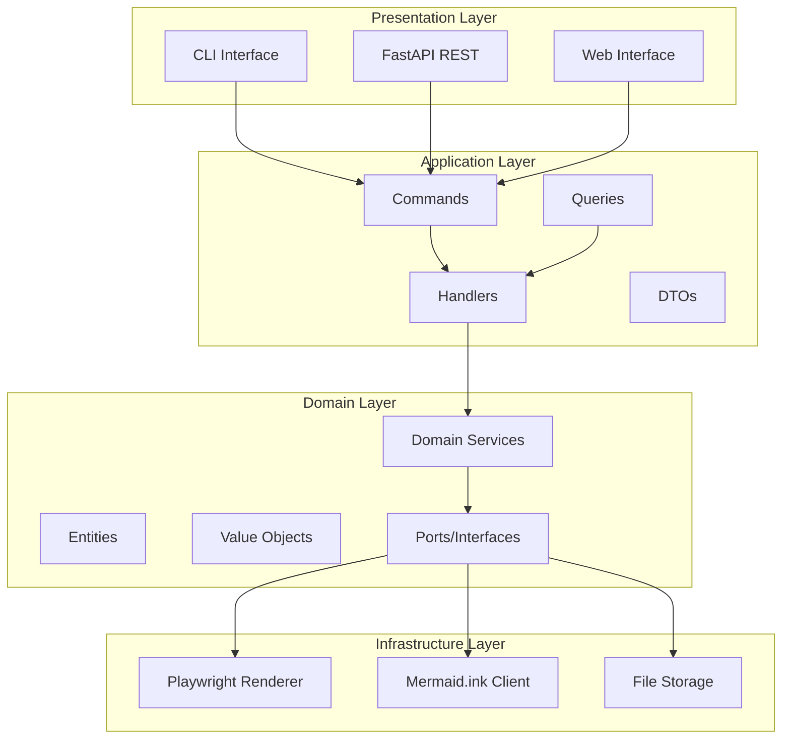

# Architecture Documentation

## Overview

MermaidView is built using **Domain-Driven Design (DDD)** principles with a **Hexagonal Architecture** (Ports and Adapters). This architecture ensures:

- Clear separation of concerns
- Testability through dependency injection
- Flexibility to swap implementations
- Framework-agnostic domain logic

## Architecture Diagram



## Layer Details

### 1. Domain Layer (`src/mermaid_view/domain/`)

The heart of the application containing business logic. This layer is:
- Framework-agnostic
- Has no external dependencies
- Defines core business rules

#### Entities (`domain/entities/`)

- **Diagram**: The main aggregate root representing a Mermaid diagram with its code, configuration, and rendered data.

```python
@dataclass
class Diagram:
    id: UUID
    code: MermaidCode
    config: RenderConfig
    created_at: datetime
    updated_at: datetime
    name: str | None
    rendered_data: bytes | None
```

#### Value Objects (`domain/value_objects/`)

Immutable objects that represent domain concepts:

- **MermaidCode**: Encapsulates Mermaid diagram code with validation
- **DiagramType**: Enum of supported diagram types (flowchart, sequence, etc.)
- **RenderConfig**: Configuration for rendering (size, theme, format, etc.)
- **OutputFormat**: Enum (PNG, SVG, PDF)
- **Theme**: Enum (default, forest, dark, neutral, base)

#### Ports (`domain/ports/`)

Interfaces that define contracts for external dependencies:

- **IRenderPort**: Interface for rendering diagrams
- **IStoragePort**: Interface for storage operations

```python
class IRenderPort(ABC):
    async def render_to_png(self, code: MermaidCode, config: RenderConfig) -> bytes: ...
    async def render_to_svg(self, code: MermaidCode, config: RenderConfig) -> bytes: ...
    async def is_available(self) -> bool: ...
```

#### Services (`domain/services/`)

- **DiagramService**: Orchestrates rendering and storage operations

### 2. Application Layer (`src/mermaid_view/application/`)

Implements use cases by coordinating between domain and infrastructure.

#### Commands (`application/commands/`)

- **RenderDiagramCommand**: Command to render a diagram

#### Queries (`application/queries/`)

- **GetDiagramQuery**: Query to retrieve a diagram

#### Handlers (`application/handlers/`)

- **DiagramHandler**: Handles commands and queries, coordinates with domain service

#### DTOs (`application/dtos/`)

Data Transfer Objects for API communication:
- **RenderRequestDTO**: Input for render requests
- **RenderResponseDTO**: Output from render operations
- **DiagramDTO**: Diagram representation for API

### 3. Infrastructure Layer (`src/mermaid_view/infrastructure/`)

Implements ports and provides external integrations.

#### Adapters (`infrastructure/adapters/`)

- **PlaywrightRenderer**: Renders diagrams using Chromium headless browser
- **MermaidInkRenderer**: Renders via mermaid.ink API (fallback)
- **FileStorage**: Handles file system operations

#### Web (`infrastructure/web/`)

FastAPI application:
- **app.py**: Application factory
- **routes.py**: API endpoints
- **templates/**: HTML templates for web interface

#### Config (`infrastructure/config.py`)

Application configuration from environment variables.

### 4. Presentation Layer (`src/mermaid_view/presentation/`)

User interfaces:
- **cli.py**: Command-line interface using Typer

## Rendering Strategy

The application uses a **Strategy Pattern** for rendering:

```
┌─────────────────┐
│ DiagramService  │
└────────┬────────┘
         │
         ▼
┌─────────────────────────┐
│      IRenderPort        │ ◄─── Port (Interface)
└────────┬────────────────┘
         │
    ┌────┴────┐
    ▼         ▼
┌────────┐ ┌────────────┐
│Playwright│ │MermaidInk │ ◄─── Adapters (Implementations)
│Renderer │ │ Renderer  │
└─────────┘ └───────────┘
```

**Primary**: PlaywrightRenderer (high quality, full control)
**Fallback**: MermaidInkRenderer (when Playwright unavailable)

## Data Flow

### Render Request Flow

```
1. User Request (CLI/API/Web)
         │
         ▼
2. RenderRequestDTO (validation)
         │
         ▼
3. RenderDiagramCommand
         │
         ▼
4. DiagramHandler.handle_render_command()
         │
         ▼
5. Diagram Entity (created)
         │
         ▼
6. DiagramService.render_diagram()
         │
         ▼
7. IRenderPort.render_to_png() 
   (Playwright or MermaidInk)
         │
         ▼
8. Binary data (PNG/SVG)
         │
         ▼
9. IStoragePort.save_rendered_output() (optional)
         │
         ▼
10. RenderResponseDTO
```

## Testing Strategy

### Unit Tests
- Domain layer: Value objects, entities, exceptions
- Application layer: Commands, queries, handlers (with mocks)

### Integration Tests
- Adapter tests with real external services
- End-to-end rendering tests

### Test Doubles
- Mock renderers for fast unit tests
- Temporary file system for storage tests

## Design Decisions

### 1. Why Playwright over other options?

- Full Mermaid.js compatibility (uses real browser)
- High-quality rendering
- Support for all diagram types
- Good Docker support

### 2. Why mermaid.ink as fallback?

- No browser installation required
- Works when Playwright unavailable
- Simple HTTP-based API

### 3. Why DDD/Hexagonal Architecture?

- Clear separation of business logic
- Easy to test and maintain
- Flexible to change implementations
- Framework-independent core

### 4. Why async throughout?

- Better performance for I/O operations
- Browser operations are inherently async
- HTTP client operations benefit from async

## Extension Points

### Adding a new renderer

1. Implement `IRenderPort` interface
2. Register in dependency injection
3. Update configuration

### Adding a new output format

1. Add to `OutputFormat` enum
2. Implement rendering logic in adapters
3. Update API and CLI

### Adding a new storage backend

1. Implement `IStoragePort` interface
2. Create new adapter class
3. Update dependency injection
